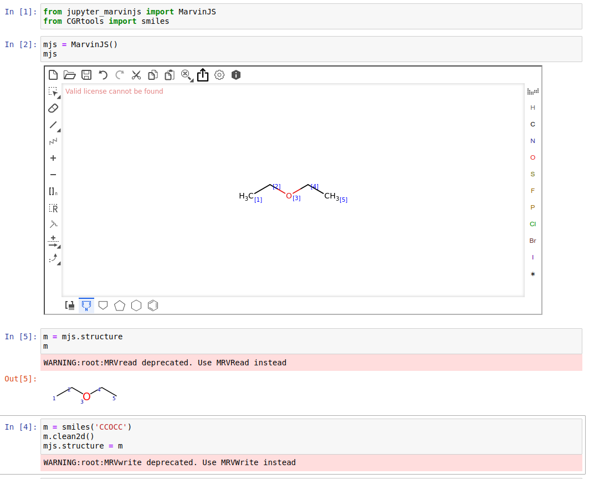

jupyter-marvinjs
================

MarvinJS and Chython integration

Usage
-----

In jupyter notebook:

    from jupyter_marvinjs import MarvinJS
    mjs = MarvinJS()
    mjs  # this render MJS

Draw structure in MJS and press `Upload` button on top panel for transferring to python side.

For accessing structure use `mjs.structure` property:

    mol = mjs.structure

For loading structure to editor:

    mol = chython.smiles('CCO')
    mol.clean2d()
    mjs.structure = mol

Installation
------------

First of all download MarvinJS distributive from chemaxon website.
Unpack it to project with name `mjs`.
Make sure `mjs` directory contains `editor.html` and located at same level as `setup.py`.

To install use pip:

    $ python setup.py bdist_wheel
    $ pip install jupyter_marvinjs-<version>.whl

If not working:

    $ jupyter nbextension install --py --sys-prefix jupyter_marvinjs
    $ jupyter nbextension enable --py --sys-prefix jupyter_marvinjs

For a development installation (requires [Node.js](https://nodejs.org) and [Yarn version 1](https://classic.yarnpkg.com/)),

    $ git clone https://github.com/stsouko/marvin_jupyter.git
    $ cd marvin_jupyter
    $ pip install -e .
    $ jupyter nbextension install --py --symlink --overwrite --sys-prefix jupyter_marvinjs
    $ jupyter nbextension enable --py --sys-prefix jupyter_marvinjs
    $ jupyter labextension develop --overwrite jupyter_marvinjs
